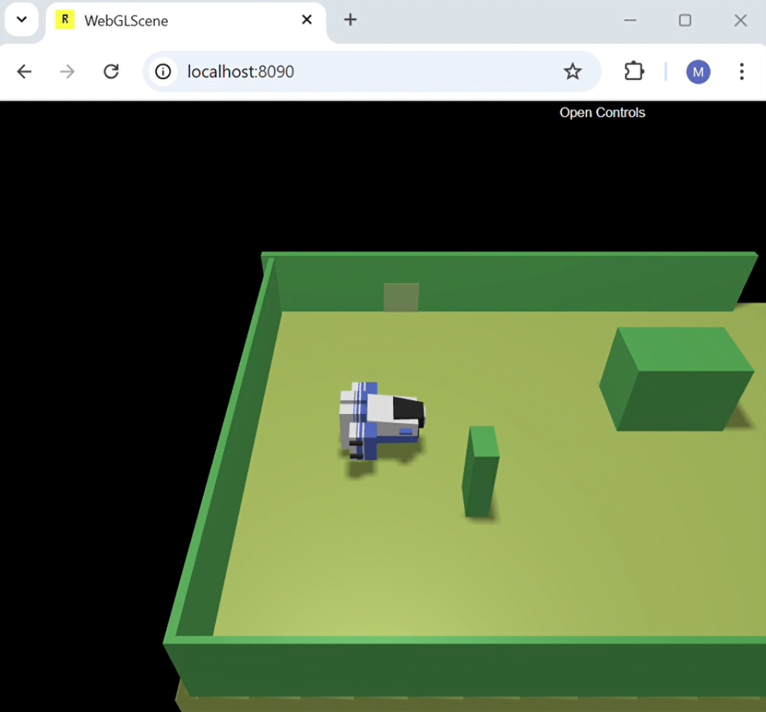

  
  <h1>Waste Incinerator</h1>
  
  Distributed software system for a ***waste Incinerator service***. The project had been developed for the course of Software Systems Engineering M of the 
  University of Bologna, using the [SCRUM agile framework](https://www.scrum.org/resources/what-is-scrum).
  
  [System requirements](https://github.com/NicoleGiulianelli2/TemaFinale2024/blob/main/commons/System%20requirements.pdf)
  ·
  [SCRUM Guide](./commons/2020-Scrum-Guide-US.pdf)

  
  
  
  

