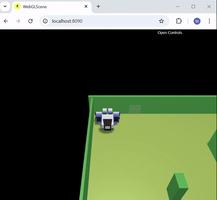
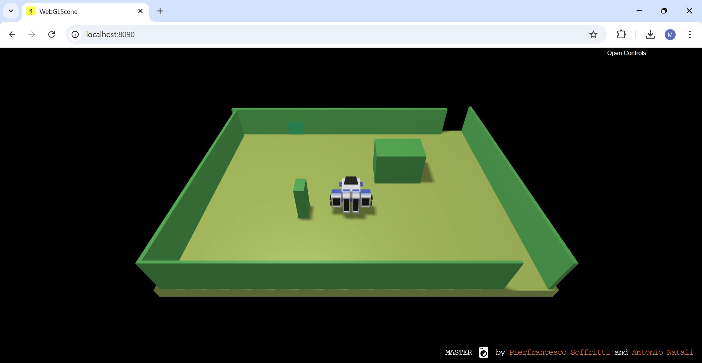
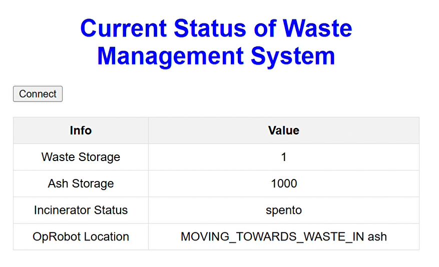
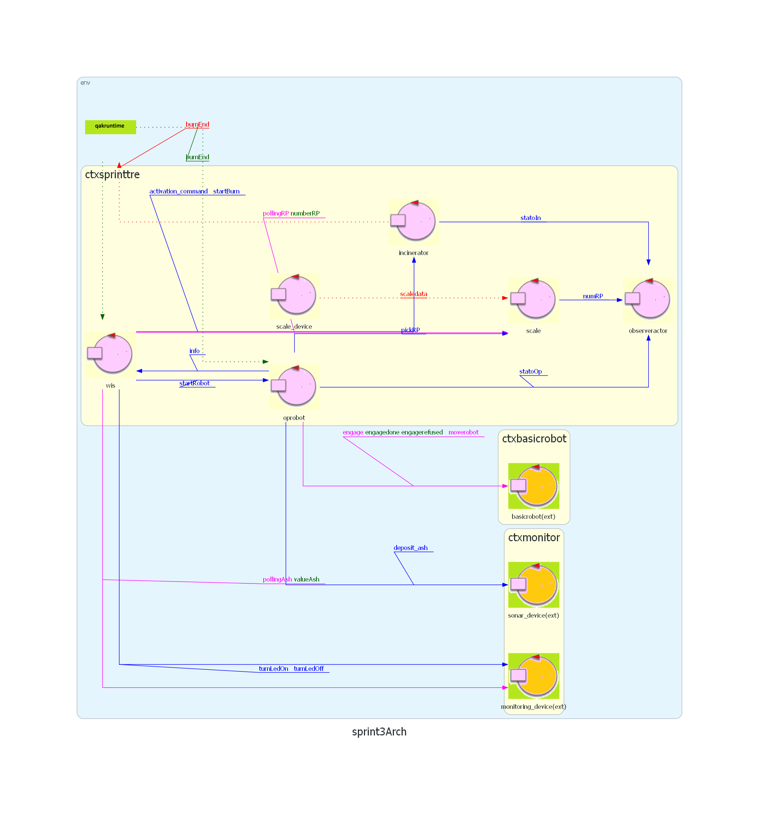

  
  <h1>Waste Incinerator</h1>
  
  Distributed software system for a ***waste Incinerator service***. The project had been developed for the course of Software Systems Engineering M of the 
  University of Bologna, using the [SCRUM agile framework](https://www.scrum.org/resources/what-is-scrum).
  
  [System requirements](https://github.com/NicoleGiulianelli2/TemaFinale2024/blob/main/commons/System%20requirements.pdf)
  ·
  [SCRUM Guide](./commons/2020-Scrum-Guide-US.pdf)

   

## The system

The system is based on the concept of **actors** and therefore operates by exchanging messages.
 
It consists of different elements:

#### Virtualrobot/basicRobot
Web application provided by the customer that simulates a Robot. The robot is confined in a virtual environment (a rectangular room) and can receive commands to perform some actions. 
The robot's movements are intermediated by an interface called basicRobot which also allows to control other types of (physical) robots.

#### Waste Incinerator Core

The core of the application has three components: the **WIS** (coordinator), the **Incinerator** and the **OpRobot**. The WIS has the task of understanding when the requirements are met and sending a signal to the OpRobot, which will start the routine by moving the virtualRobot.

#### Monitoring Device
The monitoring device runs on a **Raspberry Pi**. It controls an LED that lights up every time the incinerator is burning and flashes when the ash container is empty (there is a sonar that monitors the ash level).

#### GUI
The GUI allows to observe the **changes** in the system via a web interface, i.e. the number of waste arriving, the status of the incinerator, the position of the Robot and the ash level. Spring Boot is used.

## Final system architecture

 

From this model we can see that the system presents different actors in different contexts, who operate by **exchanging messages**, offering services to other components.

